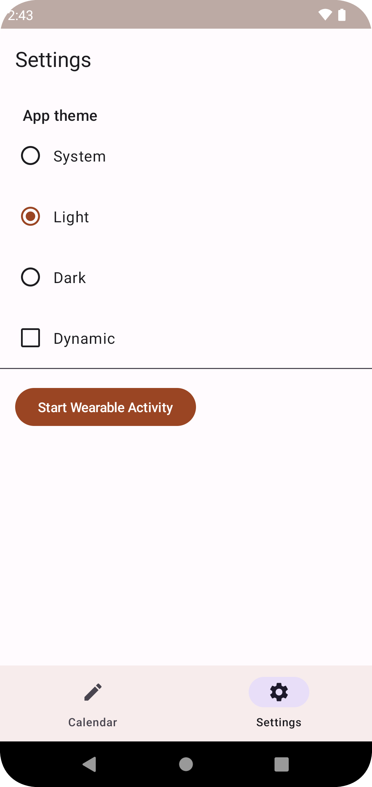
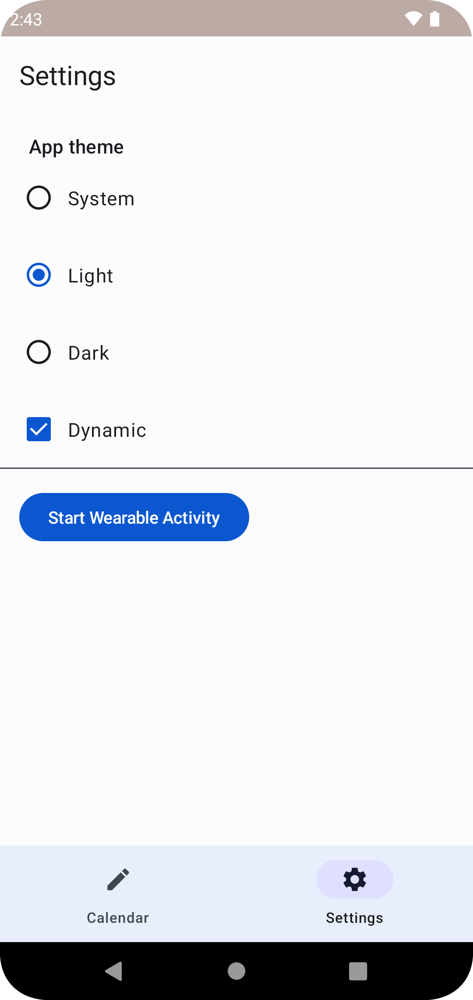
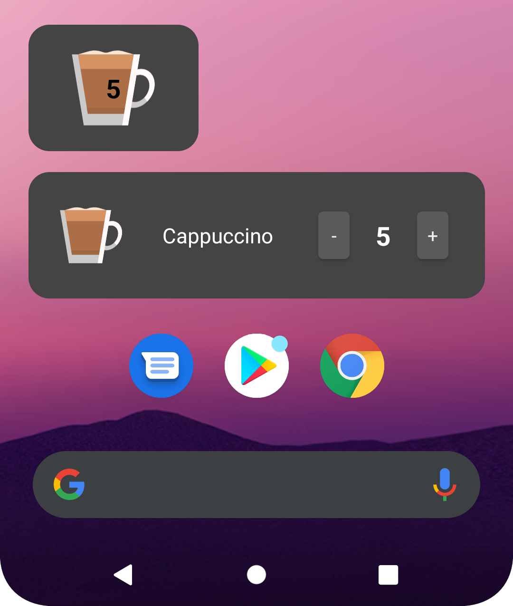
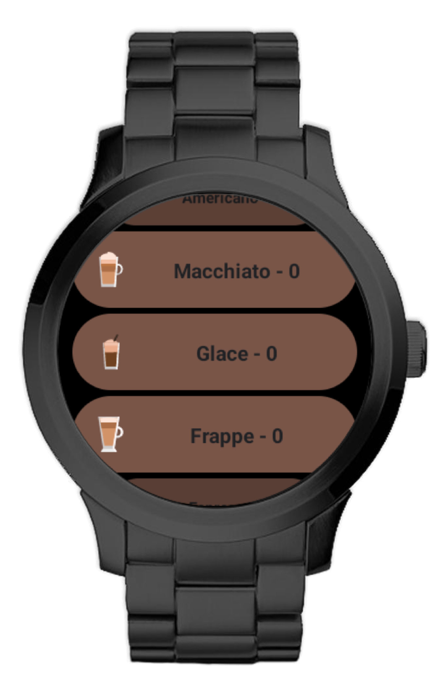

# Coffeegram

## Android app in Jetpack Compose and MVI

- Animated splash for Android 12

- Material3 Dynamic(Harmonized, following device's theme)/Day/Night themes (switch enabled)

- Glance AppWidgets

- Compose for Wearable

- Jetpack Datastore

- Realm Multiplatform as an underlying database

 

 

---

**Multiplatform version of the app for Android + Desktop (using Jetbrains Compose)** is available in [Coffeegram-Desktop](https://github.com/phansier/Coffeegram-Desktop) repo

---

## More about initial app creation:

[Medium EN](https://proandroiddev.com/change-my-mind-or-android-development-transformation-to-jetpack-compose-coroutines-e719a342cc52)

[Habr RU](https://habr.com/ru/company/kaspersky/blog/513364/)

[Youtube (AppsFest) RU](https://youtu.be/CuCV-SGUuCQ/)
