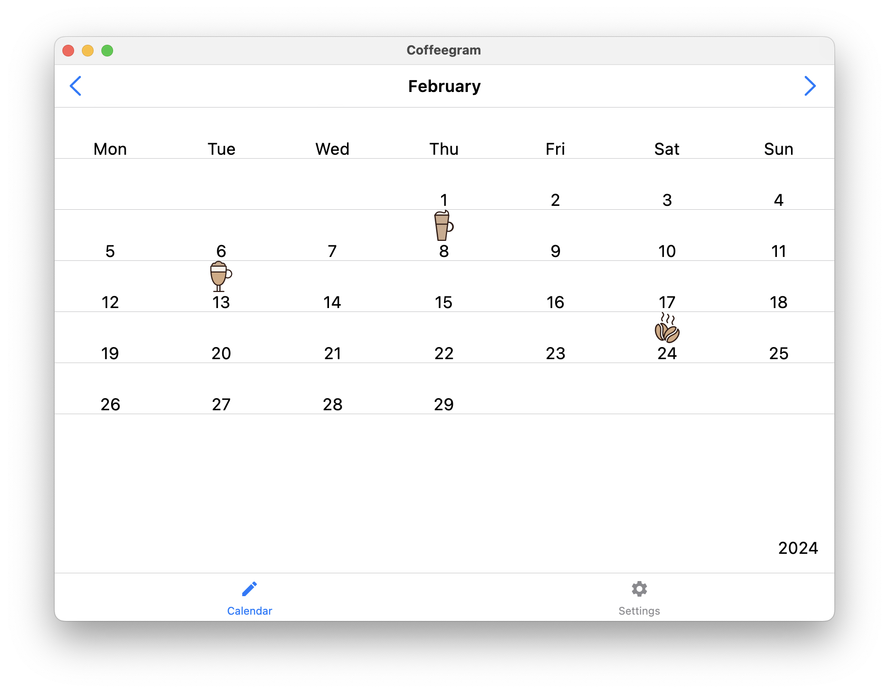
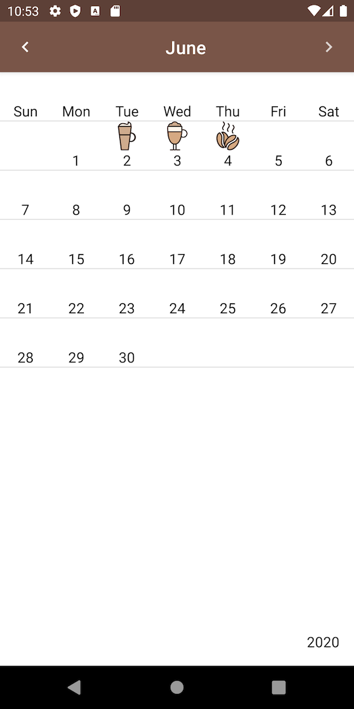
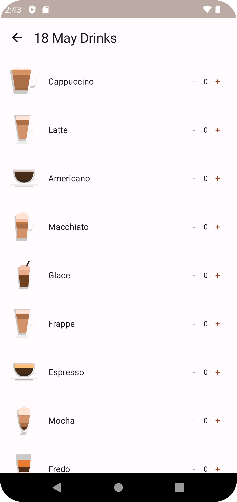

# Coffeegram

Android app using Jetpack Compose together with StateFlow and MVI

---

Multiplatform version of app for Android + Desktop in branch [desktop](https://github.com/phansier/Coffeegram/tree/desktop)

It uses Jetbrains version of Compose so can't be merged into master.

---

More about initial app creation:

[Medium EN](https://proandroiddev.com/change-my-mind-or-android-development-transformation-to-jetpack-compose-coroutines-e719a342cc52)

[Habr RU](https://habr.com/ru/company/kaspersky/blog/513364/)

[Youtube (AppsFest) RU](https://youtu.be/CuCV-SGUuCQ/)

Additional info about Jetpack Compose can be found in the [mindmap](mindmap.md).

After implementation of repository part it will be suitable for tracking of consumed coffee cups.

The App consists of two screens:
1) Table Month page

2) Coffees list page

