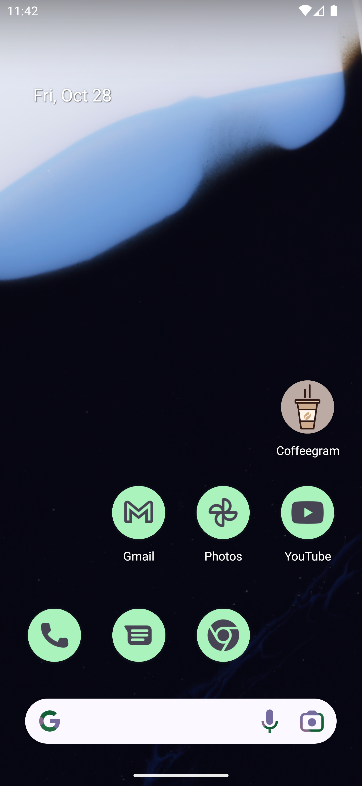
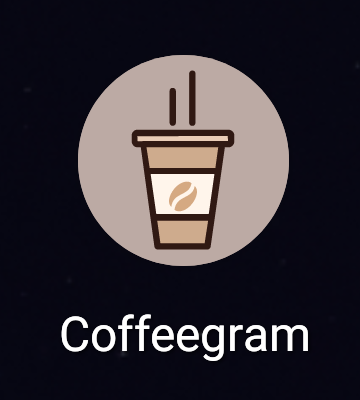
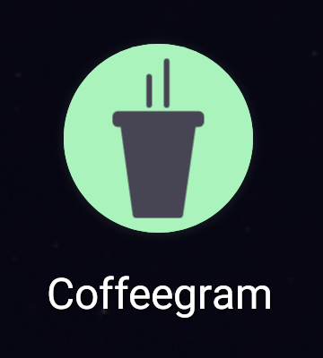
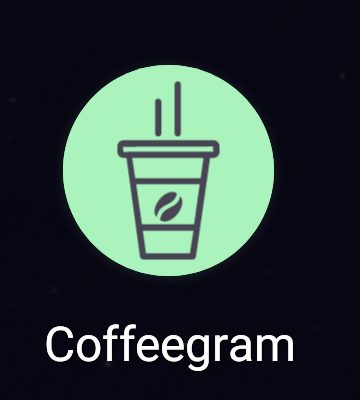

# Android 13 Monochrome icons

One of the features of Android 13 is the implementation of themed app icons.
You can  enable them by long pressing on your home screen, going to `Wallpaper & style` and selecting `Themed icons`.

As for this application you will see the following screen icon:



And the only icon:



Next we can add `monochrome` tag in `mipmap-anydpi-v26/ic_launcher.xml` with the same drawable as for `foreground`.

```
<adaptive-icon xmlns:android="http://schemas.android.com/apk/res/android">
    <background android:drawable="@color/brown_200" />
    <foreground android:drawable="@drawable/ic_launcher_foreground" />
    <monochrome android:drawable="@drawable/ic_launcher_foreground" />
</adaptive-icon>
```

The icon will be completely flooded:




Next we can copy `@drawable/ic_launcher_foreground` and remove the paths.

```
<adaptive-icon xmlns:android="http://schemas.android.com/apk/res/android">
    <background android:drawable="@color/brown_200" />
    <foreground android:drawable="@drawable/ic_launcher_foreground" />
    <monochrome android:drawable="@drawable/ic_launcher_monochrome" />
</adaptive-icon>
```

The icon will become optimal and more detailed:



For more detailes see the commit, where current doc were added.
